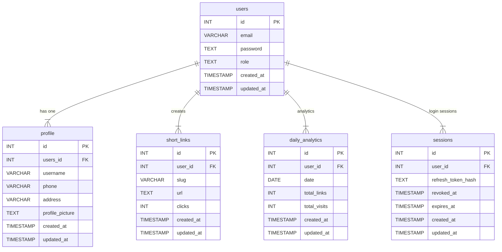

# README – Backend (Golang + Gin + PostgreSQL + Redis)

Backend ini adalah layanan REST API untuk aplikasi KODA URL Shortener yang menyediakan fitur:

- Pembuatan short link

- Redirect berdasarkan slug

- Statistik klik (database + Redis)

- Autentikasi user (JWT)

- CRUD user & management link

- Redis caching & flushing mechanism

## 🚀 How to Run Backend

Masuk ke directory backend:

- cd backend
- go mod tidy
- go run main.go

| Method | Endpoint                    | Description       |
| ------ | --------------------------- | ----------------- |
| POST   | `/api/v1/links`             | Create short link |
| GET    | `/:slug`                    | Redirect          |
| POST   | `/api/v1/auth/login`        | Login             |
| POST   | `/api/v1/auth/register`     | Register          |
| PUT   | `/api/v1/links/:slug`     | Edit          |
| DELETE   | `/api/v1/links/:slug`     | Delete          |

## 🔁 Redis Flushing Mechanism

Counter klik real-time

Cache short link (slug → URL)

### ERD 
